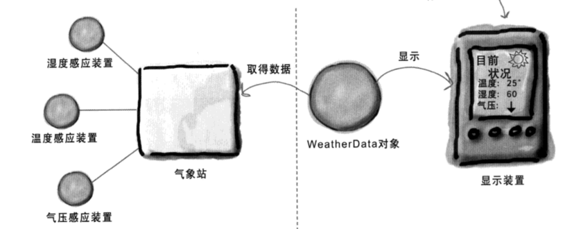
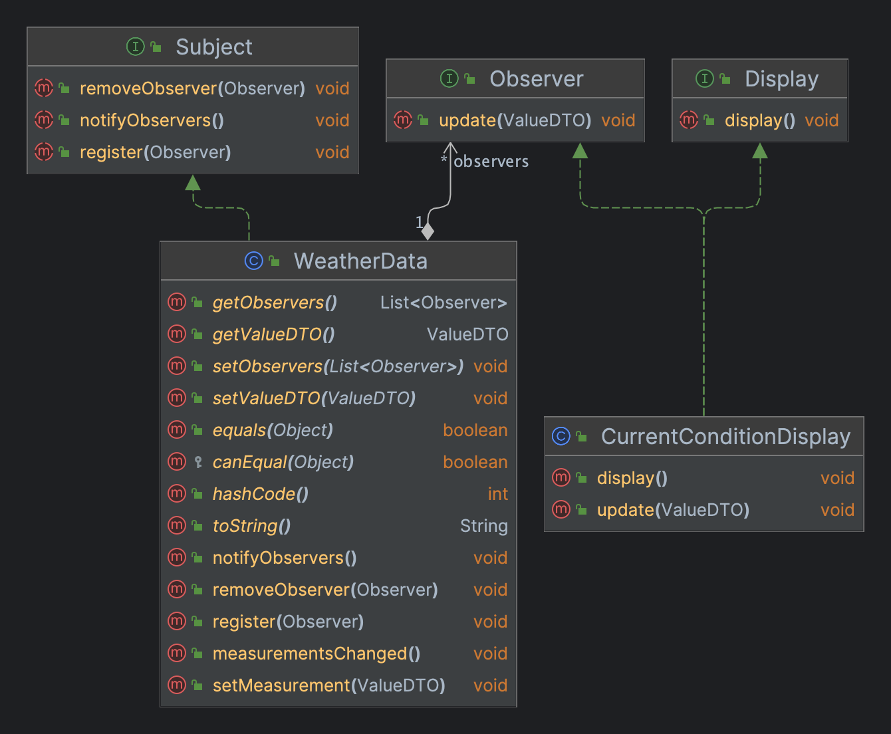

# 观察者模式（Observer）

> **出版者 + 订阅者 = 观察者模式**  

## 场景
贵公司新谈成一笔合约，内容要求：  
1. 建立一个气象站，该气象站必须建立在甲方专利申请中的WeatherData上，有三个布告板，分别显示目前状况，三种布告板必须实时更新；
2. 这个气象站必须可扩展，希望能够提供一组API，让其他开发写出自己的布告板。



## 类图



## 实现

### 主题（Subject）
```java
public interface Subject {
    void register(Observer observer);
    void removeObserver(Observer observer);
    void notifyObservers();
}
```

### 观察者（Observer）
```java
public interface Observer {
    void update(ValueDTO valueDTO);
}
```

### 布告板（element）
```java
public interface Display {
    void display();
}
```

### 气象站（WeatherData）
```java
@Data
public class WeatherData implements Subject {
    
    private List<Observer> observers;
    private ValueDTO valueDTO;

    public WeatherData() {
        observers = new ArrayList<>();
    }

    @Override
    public void register(Observer observer) {
        observers.add(observer);
    }

    @Override
    public void removeObserver(Observer observer) {
        observers.remove(observer);
    }

    @Override
    public void notifyObservers() {
        for (Observer observer : observers) {
            observer.update(valueDTO);
        }
    }

    public void measurementsChanged() {
        notifyObservers();
    }

    /**
     * 当气象站观测新值后调用该方法，通知所有观察者
     */
    public void setMeasurement(ValueDTO valueDTO) {
        this.valueDTO = valueDTO;
        measurementsChanged();
    }
}
```

### MessageDTO（ValueDTO）
```java
@Builder
@Value
public class ValueDTO {

    private String name;
    private String value;
    private String remark;
}
```

### 布告板实现1（TemperatureDisplay）
```java
public class TemperatureDisplay implements Display, Observer{

  private ValueDTO valueDTO;

  @Override
  public void display() {
    System.out.println("温度板：" + JSONUtil.toJsonStr(valueDTO));
  }

  @Override
  public void update(ValueDTO valueDTO) {
    this.valueDTO = valueDTO;
    display();
  }
}
```

### 启动程序（WeatherStation）

```java
public class WeatherStation {

    public static void main(String[] args) {

        WeatherData weatherData = new WeatherData();
        CurrentConditionDisplay currentConditionDisplay = new CurrentConditionDisplay();
        TemperatureDisplay temperatureDisplay = new TemperatureDisplay();

        // 注册观察者
        weatherData.register(currentConditionDisplay);
        weatherData.register(temperatureDisplay);

        // 模拟气象站信息变更，通知WeatherData
        weatherData.setMeasurement(ValueDTO.builder().name("温度").value("30.9").remark("温度高0000000").build());
        weatherData.setMeasurement(ValueDTO.builder().name("气压").value("2000").remark("气压高0000000").build());
        weatherData.setMeasurement(ValueDTO.builder().name("湿度").value("0.9").remark("湿度高0000000").build());
    }
}
```

> 思考:  
> 1. 如果数值变化超过1度才会通知观察者，该怎么实现
> 2. 如果我不想什么都让WeatherData push给我，我想自己pull信息，该怎么实现
