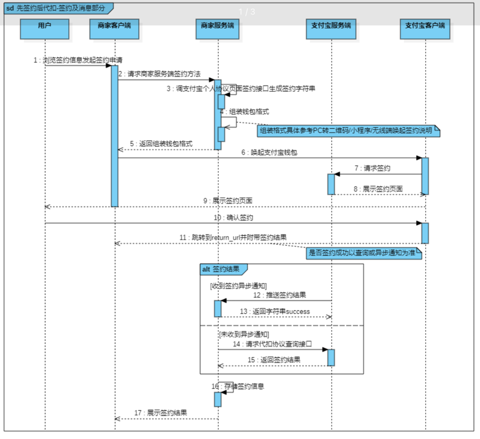

## 场景
- 连续订阅服务（会员到期自动扣费）
- 先享后付（乘车码）

## 模式

> 以支付宝周期扣款为例

### 独立签约后扣款

用户现在签约页面进行签约，待签约生效后，商家按照签约协议规则进行扣款

#### 页面流程

#### 业务流程

### 支付并签约

用户在支付流程中，同时完成支付和签约。待签约生效后，商家可以按照协议中的时间进行扣款。

#### 页面流程

#### 业务流程

## 后续解约&扣款

### 解约有两种方式：
- 用户自己在支付宝APP上解约
- 商家调用`alipay.user.agreement.unsign`接口进行解约

### 扣款

商家根据用户签约成功支付宝返回的协议号（agreement_no）每次主动调 `alipay.trade.pay`（统一收单交易支付接口），完成周期扣款协议后续免密代扣操作

## 注意点

- 1、扣款周期规则：周期类型为`DAY`，周期数（`period`）>= 7，周期类型为`MONTH`，计划扣款时间（`execute_time`）不允许传29、30、31号
- 2、扣款动作允许商家提前5日进行扣款，如：约定扣款日期为20号，商家可从15-20号发起扣款，若同一个单子在15号扣失败，16号又在次发起扣款，此时需要处理out_trade_no，否则报错"重复单号"
- 3、扣款时间必须在周期规则中，如果第一期扣失败，则需要商家调用`alipay.user.agreement.executionplan.modify`修改扣款执行计划，否则下期扣款会失败
- 4、签约和修改扣款执行计划时间不能间隔太短，否则会报`CONCURRENT_CHECK_FAIL`错误
- 5、支付并签约模式，首期扣款金额不能为0元

> 参考：
 - [支付宝周期扣款](https://opendocs.alipay.com/open/20190319114403226822)  
 - [支付宝商家扣款（新）](https://opendocs.alipay.com/open/repo-0243dw)  
 - [微信扣费服务](https://pay.weixin.qq.com/wiki/doc/api/wxpay_v2/pages/papay.shtml)  

