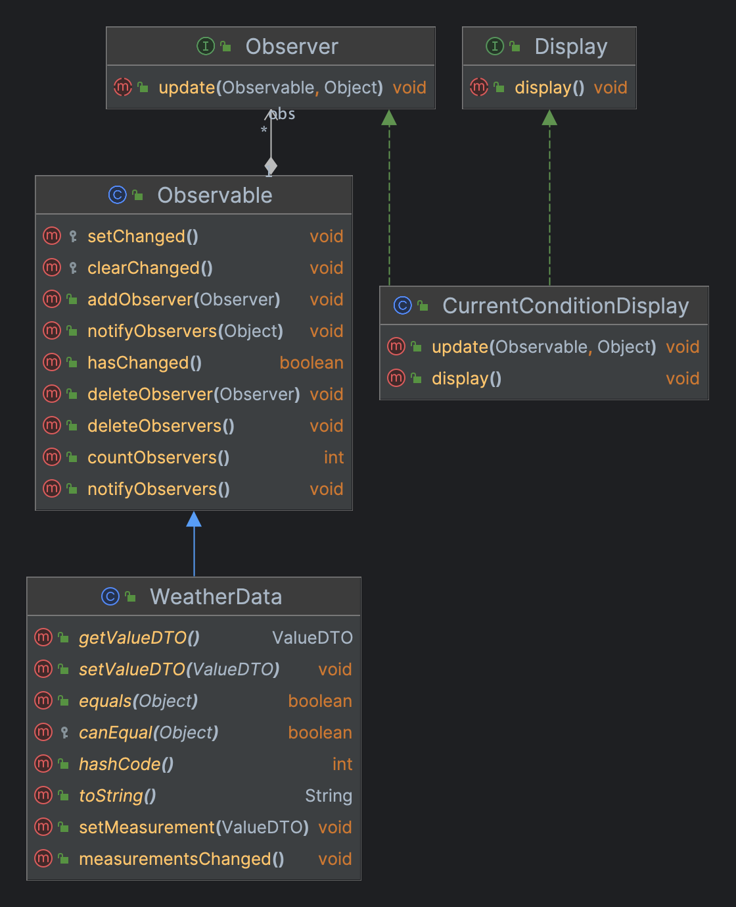

> **出版者 + 订阅者 = 观察者模式**  

## 场景
贵公司新谈成一笔合约，内容要求：  
1. 建立一个气象站，该气象站必须建立在甲方专利申请中的WeatherData上，有三个布告板，分别显示目前状况，三种布告板必须实时更新；
2. 这个气象站必须可扩展，希望能够提供一组API，让其他开发写出自己的布告板。


## 手动实现

### 类图


### 主题（Subject）
```java
public interface Subject {
    void register(Observer observer);
    void removeObserver(Observer observer);
    void notifyObservers();
}
```

### 观察者（Observer）
```java
public interface Observer {
    void update(ValueDTO valueDTO);
}
```

### 布告板（Element）
```java
public interface Display {
    void display();
}
```

### 气象站（WeatherData）
```java
@Data
public class WeatherData implements Subject {
    
    private List<Observer> observers;
    private ValueDTO valueDTO;

    public WeatherData() {
        observers = new ArrayList<>();
    }

    @Override
    public void register(Observer observer) {
        observers.add(observer);
    }

    @Override
    public void removeObserver(Observer observer) {
        observers.remove(observer);
    }

    @Override
    public void notifyObservers() {
        for (Observer observer : observers) {
            observer.update(valueDTO);
        }
    }

    public void measurementsChanged() {
        notifyObservers();
    }

    /**
     * 当气象站观测新值后调用该方法，通知所有观察者
     */
    public void setMeasurement(ValueDTO valueDTO) {
        this.valueDTO = valueDTO;
        measurementsChanged();
    }
}
```

### MessageDTO（ValueDTO）
```java
@Builder
@Value
public class ValueDTO {

    private String name;
    private String value;
    private String remark;
}
```

### 布告板实现1（TemperatureDisplay）
```java
public class TemperatureDisplay implements Display, Observer{

  private ValueDTO valueDTO;

  @Override
  public void display() {
    System.out.println("温度板：" + JSONUtil.toJsonStr(valueDTO));
  }

  @Override
  public void update(ValueDTO valueDTO) {
    this.valueDTO = valueDTO;
    display();
  }
}
```

### 启动程序（WeatherStation）

```java
public class WeatherStation {

    public static void main(String[] args) {

        WeatherData weatherData = new WeatherData();
        CurrentConditionDisplay currentConditionDisplay = new CurrentConditionDisplay();
        TemperatureDisplay temperatureDisplay = new TemperatureDisplay();

        // 注册观察者
        weatherData.register(currentConditionDisplay);
        weatherData.register(temperatureDisplay);

        // 模拟气象站信息变更，通知WeatherData
        weatherData.setMeasurement(ValueDTO.builder().name("温度").value("30.9").remark("温度高0000000").build());
        weatherData.setMeasurement(ValueDTO.builder().name("气压").value("2000").remark("气压高0000000").build());
        weatherData.setMeasurement(ValueDTO.builder().name("湿度").value("0.9").remark("湿度高0000000").build());
    }
}
```

> 思考:  
> 1. 如果数值变化超过1度才会通知观察者，该怎么实现？
> 2. 如果不想什么都让WeatherData push给我，我想自己pull信息，该怎么实现？

## JDK内置观察者模式

### 类图



> Subject -> Observable（package java.util）  
> Observer -> Observer（package java.util）

### Java内置的观察者是如何运作的？

#### 如何成为可被观察者？

继承`java.util.Observable`

#### 如何成为观察者？

实现观察者接口`java.util.Observer`，调用`Observable.addObserver()`成为观察者；调用`Observable.deleteObserver()`取消观察者。

#### 消息如何通知？

1. 先调用`setChanged()`方法，标记状态已经改变的事实；  

> `思考1`的解答：利用`private boolean changed = false;`状态来控制是否通知观察者
{: .prompt-info }
2. 然后调用两种`notifyObservers()`方法中的一个：`notifyObservers()`或`notifiyObservers(Object arg)`

#### 观察者如何接收通知

实现`update(Observable o, Object arg)`

> `思考2`的解答：如果采用**push**模式，可以直接把数据作为**arg**传给观察者；如果采用**pull**模式，可以使用**o**可被观察者主动获取数据
{: .prompt-info }

### 气象站（WeatherData）
```java
@Data
public class WeatherData extends Observable {

    private ValueDTO valueDTO;

    public WeatherData() {

    }

    /**
     * 当气象站观测新值后调用该方法，通知所有观察者
     */
    public void setMeasurement(ValueDTO valueDTO) {
        this.valueDTO = valueDTO;
        measurementsChanged();
    }

    public void measurementsChanged() {
        setChanged();
        notifyObservers(this.valueDTO.getName());
    }
}
```

### 布告板实现1（CurrentConditionDisplay）

```java
public class CurrentConditionDisplay implements Display, Observer {

    private ValueDTO valueDTO;

    @Override
    public void display() {
        System.out.println("公告板：" + JSONUtil.toJsonStr(valueDTO));
    }

    @Override
    public void update(Observable o, Object arg) {
        if (o instanceof WeatherData) {
            System.out.println("公告板读取push数据:" + arg);
            // 主动pull
            ValueDTO data = ((WeatherData) o).getValueDTO();
            this.valueDTO = data;
            System.out.println("公告板拉取pull数据:" + JSONUtil.toJsonStr(data));
        }
    }
}
```

### jdk`Observable`源码

```java
public class Observable {
  //是否被改变
  private boolean changed = false;
  //维持一个Vector集合用来装观察者对象，注意Vector是线程安全的
  private Vector obs;
  //构造方法
  public Observable() {
    obs = new Vector();
  }

  /**
   * 添加观察者
   * @param o
   */
  public synchronized void addObserver(Observer o) {
    if (o == null)
      throw new NullPointerException();
    if (!obs.contains(o)) {
      obs.addElement(o);
    }
  }

  /**
   * 删除观察者对象
   * @param o
   */
  public synchronized void deleteObserver(Observer o) {
    obs.removeElement(o);//调用vector的removeElement方法把观察者移除出去
  }

  /**
   * 通知所有的观察者更新
   */
  public void notifyObservers() {
    notifyObservers(null);
  }

  /**
   * 通知所有的观察者
   * @param arg
   */
  public void notifyObservers(Object arg) {//

    Object[] arrLocal;

    //给当前的类实例上锁
    synchronized (this) {
      //如果没有发生变化
      if (!changed)
        return;
      arrLocal = obs.toArray();
      //调用clearChanged方法清除变化
      clearChanged();
    }

    for (int i = arrLocal.length-1; i>=0; i--)
      ((Observer)arrLocal[i]).update(this, arg);
  }

  public synchronized void deleteObservers() {
    obs.removeAllElements();
  }

  protected synchronized void setChanged() {
    changed = true;
  }

  protected synchronized void clearChanged() {
    changed = false;
  }

  public synchronized boolean hasChanged() {
    return changed;
  }

  public synchronized int countObservers() {
    return obs.size();
  }
}
```

> 代码下载地址：<https://github.com/ni-shiliu/neil-design-mode> 
{: .prompt-tip }  

> 参考：《Head First 设计模式》


