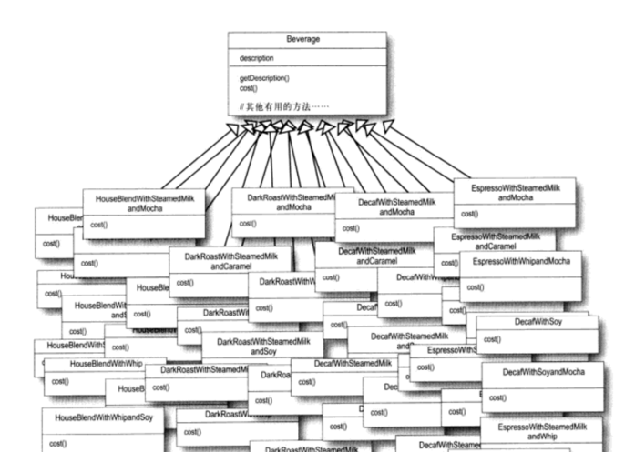
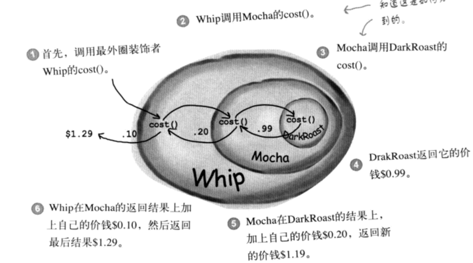
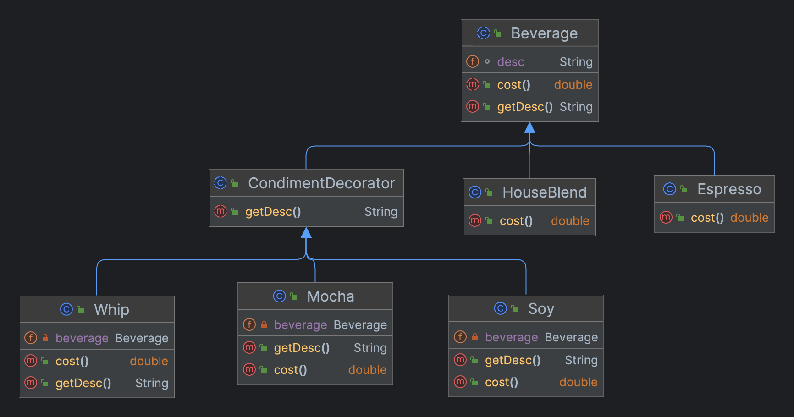

> **曾经我以为男子汉应该用继承处理一切，直到领略到运行时扩展的风采，它远比编译时期继承的威力更大。**  

## 场景
作为咖啡馆都负责人，需要设计一套结账体系，内容要求：  
1. 咖啡馆里面有很多种咖啡，每种咖啡都价格不同
2. 每种咖啡可以添加不同种类都配料，配料也可以重复添加
3. 以后新增咖啡或者配料时，要求扩展性好


## 实现

### 尝试设计



程序员不为难程序！这样设计，不仅给自己，同时也给接手它的同行制造了一个维护噩梦。那该怎么设计呢？**只要思想不滑坡，办法总比困难多**。

### 装饰者思想设计



#### 特点
- 装饰者和被装饰者有相同的超类型
- 可以用n个装饰者包装一个对象
- 装饰者可以在所委托被装饰者的行为之前或之后，加上自己的行为
- 对象可以在运行时动态的被装饰


#### 思想是进步的基石

> **开放-关闭原则**：类应该对扩展开放，对修改关闭
{: .prompt-info }

#### 类图



#### Beverage（饮料-超类）

```java
public abstract class Beverage {

    String desc = "Unknown Beverage";

    public String getDesc() {
        return desc;
    }

    public abstract double cost();
}
```

#### Espresso（浓缩咖啡-被装饰者）

```java
public class Espresso extends Beverage {

  public Espresso() {
    desc = "浓缩咖啡（Espresso）";
  }

  @Override
  public double cost() {
    return 1.99;
  }
}
```

#### CondimentDecorator（配料-装饰者抽象类）

```java
public abstract class CondimentDecorator extends Beverage {

  public abstract String getDesc();
}
```

#### Whip（配料-奶泡-装饰者）

```java
public class Whip extends CondimentDecorator {

  private Beverage beverage;

  public Whip(Beverage beverage) {
    this.beverage = beverage;
  }

  @Override
  public double cost() {
    return beverage.cost() + 0.1;
  }

  @Override
  public String getDesc() {
    return beverage.getDesc() + ", Whip";
  }
}
```

#### CoffeeShop（启动类）

> 需要自行补充`HouseBlend（被装饰者）`、`Mocha（装饰者）`、`Soy（装饰者）`

```java
public class CoffeeShop {

  public static void main(String[] args) {
    Beverage beverage = new Espresso();
    System.out.println("点一杯:" + beverage.getDesc() + ";价格：" + beverage.cost());

    beverage = new Mocha(beverage);
    beverage = new Mocha(beverage);
    beverage = new Soy(beverage);
    System.out.println("最终：" + beverage.getDesc() + ";价格:" + beverage.cost());

    Beverage beverage2 = new HouseBlend();
    System.out.println("再点一杯:" + beverage.getDesc() + ";价格：" + beverage.cost());

    beverage2 = new Whip(beverage2);
    beverage2 = new Mocha(beverage2);
    beverage2 = new Soy(beverage2);
    System.out.println("最终：" + beverage2.getDesc() + ";价格:" + beverage2.cost());
  }
}
```

> 思想精华：
> 1. **继承**：装饰者与被装饰者继承同一个超类：达到**类型匹配**，而不是利用继承获得**行为**
> 2. **组合**：装饰者之间的不同组合，获得不同**行为**
> 3. 依赖**继承**，行为只能来自超类或者子类覆盖后的版本，利用**组合**，可以混合并且可以在运行时获得行为
{: .prompt-info }


> 代码下载地址：<https://github.com/ni-shiliu/neil-design-mode> 
{: .prompt-info }  

> 参考文献：《Head First 设计模式》


