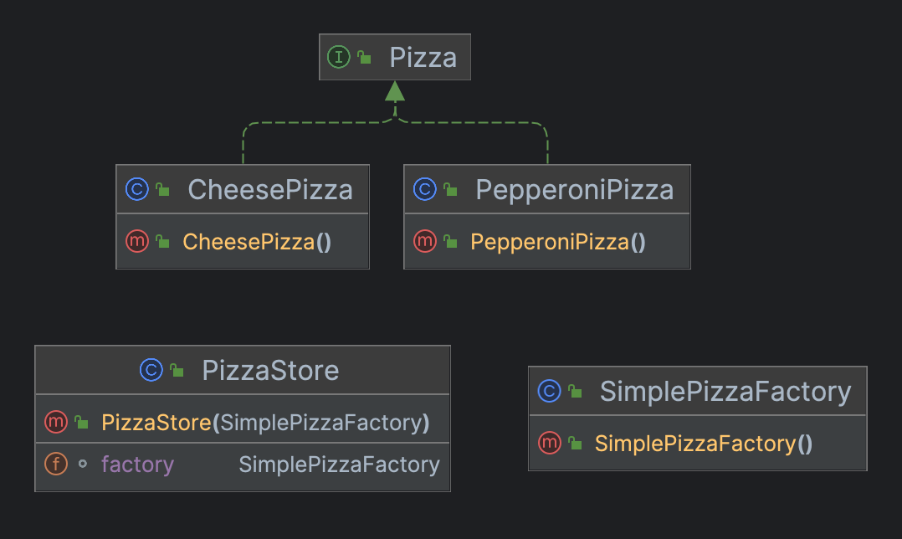
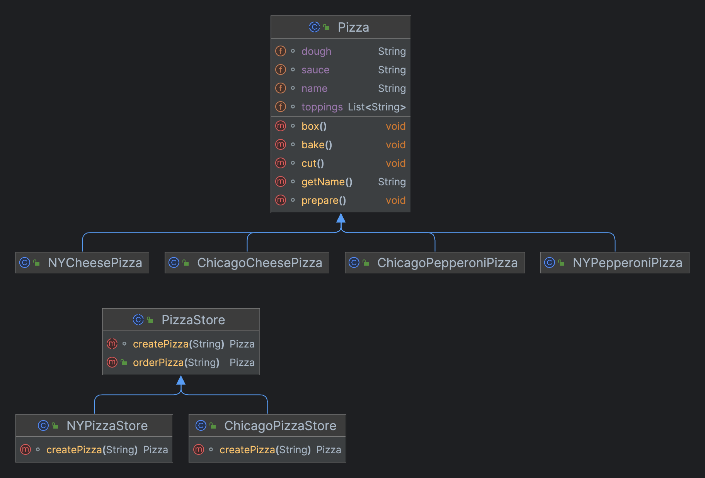

# 工厂模式（Factory）

> **世界上唯一不变的就是变化！找出变化的方面，把它们分离出来。**   

## 场景
你拥有一家比萨店，内容要求
1. 提供很多种类不同的披萨
2. 以后新增新品或删除旧品，要求扩展性好

## 简单工厂

### 类图



### 实现

#### Pizza

```java
public interface Pizza {
    void prepare();
    void bake();
    void cut();
    void box();
}
```

#### CheesePizza（芝士披萨）

```java
public class CheesePizza implements Pizza {

  @Override
  public void prepare() {
    System.out.println("Preparing CheesePizza...");
  }

  @Override
  public void bake() {
    System.out.println("bake CheesePizza...");
  }

  @Override
  public void cut() {
    System.out.println("cut CheesePizza...");
  }

  @Override
  public void box() {
    System.out.println("box CheesePizza...");
  }

  @Override
  public String getName() {
    return "CheesePizza";
  }
}
```

#### PizzaStore（披萨店）

```java
public class PizzaStore {

  SimplePizzaFactory factory;

  public PizzaStore(SimplePizzaFactory factory) {
    this.factory = factory;
  }

  public Pizza orderPizza(String type) {
    Pizza pizza = factory.createPizza(type);

    pizza.prepare();
    pizza.bake();
    pizza.cut();
    pizza.box();
    return pizza;
  }
}
```

#### SimplePizzaFactory（工厂）

```java
public class SimplePizzaFactory {

  public Pizza createPizza(String type) {
    Pizza pizza = null;

    if ("cheese".equals(type)) {
      pizza = new CheesePizza();
    } else if ("pepperoni".equals(type)) {
      pizza = new PepperoniPizza();
    }
    return pizza;
  }
}
```

#### Customer（客户）

```java
public class Customer {

  public static void main(String[] args) {
    PizzaStore pizzaStore = new PizzaStore(new SimplePizzaFactory());
    Pizza pizza = pizzaStore.orderPizza("cheese");
    System.out.println("Neil 点了一份" + pizza.getName());
  }
}
```
> 需要自行补充其他种类的Pizza

> 简单工厂其实不是设计模式中的一种，反而比较像一种编程习惯。但由于经常被使用，所以给它一个"Head First Pattern荣誉奖"。
{: .prompt-tip }

## 场景二

你的披萨店经营成功，击败了竞争者，现在大家都希望能够加盟你的披萨店。身为boss，你希望能够确保披萨品质，加盟店要按照你的规则同时又要保持一定的弹性来加盟者进行自己都改良。

### 初步尝试

采用简单工厂的思想：每个加盟店新建自己的工厂`ShanghaiFactory`、`NanjingFactory`，制作披萨的代码绑在`PizzaStore`，但这样做没有弹性。

### 工厂方法

#### 类图



#### 定义

**工厂方法模式**定义了一个创建对象的接口，但由子类决定要实例化的是哪个类。

#### PizzaStore（工厂超类）

```java
public abstract class PizzaStore {

    public Pizza orderPizza(String type) {
        Pizza pizza = createPizza(type);

        pizza.prepare();
        pizza.bake();
        pizza.cut();
        pizza.box();

        return pizza;
    }

    abstract Pizza createPizza(String type);
}
```

#### NYPizzaStore（子类工厂）

```java
public class NYPizzaStore extends PizzaStore {
    @Override
    Pizza createPizza(String type) {
        Pizza pizza = null;
        if ("cheese".equals(type)) {
            pizza = new NYCheesePizza();
        } else if ("pepperoni".equals(type)) {
            pizza = new NYPepperoniPizza();
        }
        return pizza;
    }
}
```

#### Pizza（产品类-超类）

```java
public abstract class Pizza {
    String name;
    String dough;
    String sauce;
    List<String> toppings = new ArrayList<>();

    void prepare() {
        System.out.println("Preparing " + name + ", " + dough + ", " + sauce + ", " + String.join(",", toppings));
    }

    void bake() {
        System.out.println("Bake for 25 minutes at 350");
    }

    void cut() {
        System.out.println("Cutting the pizza");
    }

    void box() {
        System.out.println("Boxing the pizza");
    }

    String getName() {
        return name;
    }
}
```

#### NYCheesePizza（具体产品）

```java
public class NYCheesePizza extends Pizza {
    public NYCheesePizza() {
        name = "NY Cheese Pizza";
        dough = "NY Cheese Thin Crust Dough";
        sauce = "NY Cheese Marinara Sauce";
        toppings.add("NY Cheese Crated Reggi Cheese");
    }
}
```

#### NYPepperoniPizza（具体产品）

```java
public class NYPepperoniPizza extends Pizza {
    public NYPepperoniPizza() {
        name = "NY Pepperoni Pizza";
        dough = "NY Pepperoni Thin Crust Dough";
        sauce = "NY Pepperoni Marinara Sauce";
        toppings.add("NY Pepperoni Crated Reggi Cheese");
    }
}
```

#### Customer（启动类）

```java
public class Customer {

    public static void main(String[] args) {
        PizzaStore nyPizzaStore = new NYPizzaStore();
        Pizza cheese = nyPizzaStore.orderPizza("cheese");
        System.out.println("Neil ordered a " + cheese.getName());

        System.out.println("=========");

        PizzaStore chicagoPizzaStore = new ChicagoPizzaStore();
        Pizza pepperoni = chicagoPizzaStore.orderPizza("pepperoni");
        System.out.println("ShiLiu ordered a " + pepperoni.getName());
    }
}
```
> 需要自行补充其他种类的Pizza和Store


> 代码下载地址：<https://github.com/ni-shiliu/neil-design-mode> 
{: .prompt-info }  

> 参考文献：《Head First 设计模式》


