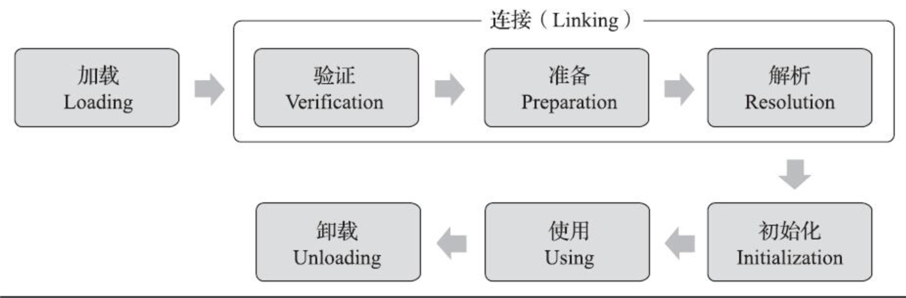

> **天无二日，国无二主**

## 定义

确保一个类只有一个实例，并提供一个全局的访问点。

## 使用场景

只需要有一个对象：线程池、数据库连接池、缓存、日志对象、处理偏好设置和注册表对象、任务管理器等

## 特点

- 优点：
  + 节省内存空间
  + 避免频繁创建销毁对象，减轻GC工作，提高性能
  + 为整个系统提提供了一个全局访问点
- 缺点：
  + 不适用于频繁变化的对象
  + 扩展困难

## 实现

### 饿汉式

```java
public class HungrySingleton {
    private static HungrySingleton hungrySingleton = new HungrySingleton();

    public HungrySingleton() {
    }

    public static HungrySingleton getInstance() {
        return hungrySingleton;
    }
}
```
> 线程安全

### 懒汉式（Double-check Locking）

```java
public class LazySingleton {

    private static volatile LazySingleton lazySingleton = null;
    public LazySingleton() {
    }

    public static LazySingleton getInstance() {
        if (lazySingleton == null) {
            synchronized (LazySingleton.class) {
                if (lazySingleton == null) {
                    lazySingleton = new LazySingleton();
                }
            }
        }
        return lazySingleton;
    }
}
```

保证线程安全的原理：  
`双重判空`：**第一次判空**，如果实例已存在，则直接返回实例，提升性能；**第二次判空**：当多个线程一起达到锁位置时，待第一个线程创建对象完成释放锁，其他线程竞争到锁后，判空直接返回实例  
`synchronized`：保证需要执行创建对象的线程只能有一个  
`volatile`：**可见性**、**禁止指令重排序**
- 可见性：**volatile**修饰的变量的修改对其他任何线程都是可见的，**两次判空**依赖该特性
- 禁止指令重排序：通过在创建对象的指令前后添加内存屏障来禁止指令冲排序

**new**关键字创建对象不是原子的，需要三步
> 1.在堆内存开辟内存空间  
> 2.调用构造方法，初始化对象  
> 3.引用变量指向内存空间  

为了提高性能，JVM虚拟机常常会对既定的代码执行顺行进行**指令重排序**，经过**指令重排序**后，创建对象的顺序可能1、2、3，也有可能1、3、2。当执行顺序是1、3、2时，执行到3（引用变量指向内存空间）时，另一个线程执行`if (lazySingleton == null)`时，会拿到没有初始化的非NUll实例，从而出现著名的**DCL**失效问题。

### 静态内部类（Static-Inner）

```java
public class StaticInnerSingleton {

    public StaticInnerSingleton() {
    }

    public static StaticInnerSingleton getInstance() {
        return InnerClass.INSTANCE;
    }

    private static class InnerClass {
        private static final StaticInnerSingleton INSTANCE = new StaticInnerSingleton();
    }
}
```

> 优点：懒加载、线程安全、效率较高、实现简单

**静态内部类是怎么实现懒加载的？**  

一个类从被加载到虚拟机中开始，到卸载出内存为止，它的整个生命周期将经历**加载**、**验证**、**准备**、**解析**、**初始化**、**使用**、**卸载**七个阶段，其中验证、准备、解析统称为**连接**。



对于类初始化阶段，《Java虚拟机规范》严格规定了**有且只有**六种情况必须立即对类进行初始化:
1. 遇到**new**、**getstatic**、**putstatic**或**invokestatic**这四条字节码指令时，如果类型没有进行过初始化，则需要先触发其初始化阶段。能够生成这四条指令的典型Java代码场景有： 
   - 使用new关键字实例化对象的时候
   - 读取或设置一个类型的静态字段（被final修饰、已在编译期把结果放入常量池的静态字段除外）的时候
   - 调用一个类型的静态方法的时候
2. 使用java.lang.reflect包的方法对类型进行反射调用的时候，如果类型没有进行过初始化，则需要先触发其初始化
3. 当初始化类的时候，如果发现其父类还没有进行过初始化，则需要先触发其父类的初始化
4. 当虚拟机启动时，用户需要指定一个要执行的主类（包含main()方法的那个类），虚拟机会先初始化这个主类
5. 当使用JDK 7新加入的动态语言支持时，如果一个java.lang.invoke.MethodHandle实例最后的解析结果为REF_getStatic、REF_putStatic、REF_invokeStatic、REF_newInvokeSpecial四种类型的方法句柄，并且这个方法句柄对应的类没有进行过初始化，则需要先触发其初始化
6. 当一个接口中定义了JDK 8新加入的默认方法（被default关键字修饰的接口方法）时，如果有这个接口的实现类发生了初始化，那该接口要在其之前被初始化

当getInstance()方法被调用时，InnerClass 才在 Singleton 的运行时常量池里，把符号引用替换为直接引用，这时静态对象 INSTANCE 也真正被创建，然后再被 getInstance()方法返回出去，这点同饿汉模式。 

**静态内部类是如何保证线程安全的？**

Java虚拟机必须保证一个类的<clinit>()方法在多线程环境中被正确地加锁同步，如果多个线程同时去初始化一个类，那么只会有其中一个线程去执行这个类的<clinit>()方法，其他线程都需要阻塞等待，直到活动线程执行完毕<clinit>()方法。如果在一个类的<clinit>()方法中有耗时很长的操作，那就可能造成多个进程阻塞，在实际应用中这种阻塞往往是很隐蔽的。


### 枚举（Enum）

```java

```


> 代码下载地址：<https://github.com/ni-shiliu/neil-design-mode> 
{: .prompt-info }  

> 参考：《Head First 设计模式》、《深入理解Java虚拟机》


