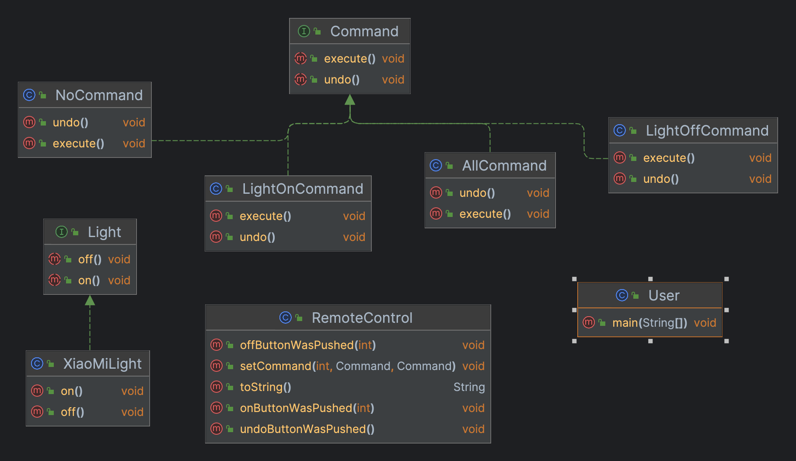

## 定义

将请求封装成对象，以便使用不同的请求、队列或日志来参数化其他对象，同时也可执行撤销操作

## 真实世界类比

**餐厅是怎么工作的？**
1. 顾客点完订单，把订单交给服务员
2. 服务员接过订单，并将订单交给后台厨师
3. 厨师根据订单开始备餐备餐

整个流程中：   
订单：订单就是一个点餐请求对象，并且可以被传递，从服务员传递到厨师手中  
服务员：服务员的任务就是接收订单、通知厨师备餐  
厨师：最终处理点餐请求

> 点餐请求、订单接收者、请求处理三者之间只通过订单请求对象，无需知道下游的具体操作便可实现完整流程。


## 场景
设计一款遥控器，该遥控器有7个插槽
1. 每个插槽可以指定不同的家电，每个插槽都有对应的开关按钮
2. 整个遥控器具有一键模式（一键开启、一键关闭）
3. 扩展性要好  

## 类图



> User（顾客）：客户负责创建一个Command命令，并设置接收者  
> RemoteControl（服务员）：触发者（Invoker）持有一个对象命令，并在某个时间点调用命令对象对execute()方法，将请求付诸行动  
> Command（LightOnCommand ...）（订单请求命令）：命令对象，将动作和接收者包装在一起，调用命令对象对execute()方法，就可以让接收者进行相关动作  
> Light（XiaoMiLight）（厨师）：接收者，实行这个请求。

类比点餐流程：
1. **User**创建一个命令**Command** 
2. 按动按钮将**Command**传递给**RemoteControl**，**RemoteControl**收到**Command**后在某个时间点传递给**Light**
3. **Light**执行具体操作


## 实现 

### Command（命令接口）

```java
public interface Command {
  void execute();
  void undo();
}
```

### LightOnCommand ...（命令对象）

```java
public class LightOnCommand implements Command {
  Light light;
  public LightOnCommand(Light light) {
    this.light = light;
  }

  @Override
  public void execute() {
    light.on();
  }

  @Override
  public void undo() {
    light.off();
  }
}

public class LightOffCommand implements Command {
  Light light;
  public LightOffCommand(Light light) {
    this.light = light;
  }

  @Override
  public void execute() {
    light.off();
  }

  @Override
  public void undo() {
    light.on();
  }
}

public class NoCommand implements Command {
  @Override
  public void execute() {
  }

  @Override
  public void undo() {
  }
}

public class AllCommand implements Command {
  Command[] commands;
  public AllCommand(Command[] commands) {
    this.commands = commands;
  }

  @Override
  public void execute() {
    for (Command command : commands) {
      command.execute();
    }
  }

  @Override
  public void undo() {

  }
}
```

> `NoCommand`是一个空对象，可以优雅对处理`null`责任，在许多时候，空对象本身也是一种设计模式
{: .prompt-tip }

### Light（Receiver）

```java
public interface Light {
  void on();
  void off();
}

public class XiaoMiLight implements Light {
  String name;
  public XiaoMiLight(String name) {
    this.name = name;
  }

  @Override
  public void on() {
    System.out.println(name + " is on...");
  }

  @Override
  public void off() {
    System.out.println(name + " is off...");
  }
}
```

### User（用户）

```java
public class User {

  public static void main(String[] args) {
    // 遥控器
    RemoteControl remoteControl = new RemoteControl();

    // 对象（Receiver）
    XiaoMiLight light1 = new XiaoMiLight("卧室1");
    XiaoMiLight light2 = new XiaoMiLight("卧室2");
    XiaoMiLight light3 = new XiaoMiLight("卧室3");
    XiaoMiLight light4 = new XiaoMiLight("卧室4");

    // 命令+对象（Receiver）
    LightOnCommand lightOnCommand1 = new LightOnCommand(light1);
    LightOffCommand lightOffCommand1 = new LightOffCommand(light1);
    LightOnCommand lightOnCommand2 = new LightOnCommand(light2);
    LightOffCommand lightOffCommand2 = new LightOffCommand(light2);
    LightOnCommand lightOnCommand3 = new LightOnCommand(light3);
    LightOffCommand lightOffCommand3 = new LightOffCommand(light3);
    LightOnCommand lightOnCommand4 = new LightOnCommand(light4);
    LightOffCommand lightOffCommand4 = new LightOffCommand(light4);

    // 遥控器按钮与命令绑定
    remoteControl.setCommand(0, lightOnCommand1, lightOffCommand1);
    remoteControl.setCommand(1, lightOnCommand2, lightOffCommand2);
    remoteControl.setCommand(2, lightOnCommand3, lightOffCommand3);
    remoteControl.setCommand(3, lightOnCommand4, lightOffCommand4);

    System.out.println(remoteControl);

    // 开启电灯
    remoteControl.onButtonWasPushed(0);
    remoteControl.onButtonWasPushed(1);
    remoteControl.onButtonWasPushed(2);
    remoteControl.onButtonWasPushed(3);
    // 关闭电灯
    remoteControl.offButtonWasPushed(0);
    remoteControl.offButtonWasPushed(1);
    remoteControl.offButtonWasPushed(2);
    remoteControl.offButtonWasPushed(3);
    System.out.println("-------- 撤销 ---------");
    // 撤销最后一步
    remoteControl.undoButtonWasPushed();

    // 全局模式
    Command[] allOn = {lightOnCommand1, lightOnCommand2, lightOnCommand3, lightOnCommand4};
    Command[] allOff = {lightOffCommand1, lightOffCommand2, lightOffCommand3, lightOffCommand4};

    AllCommand allOnCommand = new AllCommand(allOn);
    AllCommand allOffCommand = new AllCommand(allOff);

    System.out.println("-------- 全局模式 -------");
    remoteControl.setCommand(5, allOnCommand, allOffCommand);
    remoteControl.onButtonWasPushed(5);
    remoteControl.offButtonWasPushed(5);
  }
}
```

## 特点

- 优点
  + 单一职责原则：可以解耦触发和执行操作的类
  + 开闭原则：你可以在不修改已有客户端代码的情况下在程序中创建新的命令
  + 你可以实现撤销和恢复功能
  + 你可以实现操作的延迟执行
  + 你可以将一组简单命令组合成一个复杂命令
- 缺点
  + 代码可能会变得更加复杂， 因为你在发送者和接收者之间增加了一个全新的层次


> 代码下载地址：<https://github.com/ni-shiliu/neil-design-mode> 
{: .prompt-info }  

> 参考：《Head First 设计模式》


