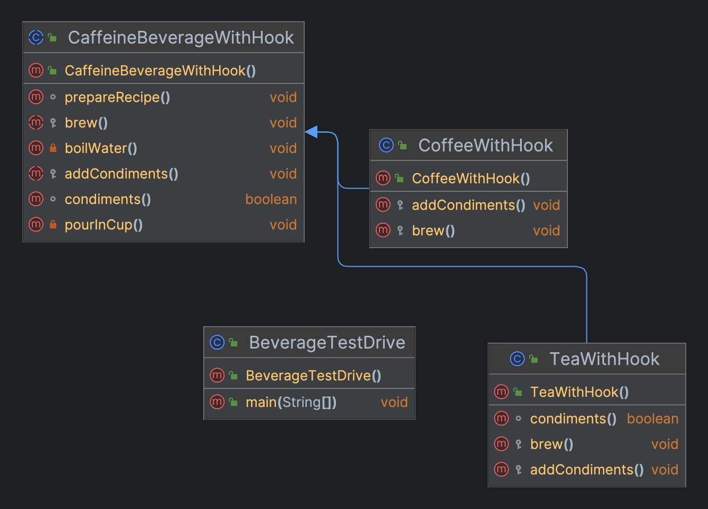

## 定义

在一个方法中定义一个方法骨架，而将一些步骤延迟到子类中，子类可以在不改变算法结构的情况下，重新定义其中一个或多个步骤

## 真实世界类比

**怎么泡一壶茶？怎么泡一杯咖啡？**
1. 把水煮沸
2. 用沸水浸泡茶叶/用沸水冲泡咖啡粉
3. 把茶倒进辈子/把咖啡倒进杯子
4. 加柠檬/加糖和奶

过程泛化后：
1. 把水煮沸
2. 冲泡
3. 把饮品倒进杯子
4. 加调料

> 模板方法就是一组步骤组成的方法，其中每个步骤都可以是抽象的。


## 场景
泡多种咖啡因饮料

## 类图



## 实现 

### CaffeineBeverageWithHook（咖啡因饮料with钩子）

```java
public abstract class CaffeineBeverageWithHook {

  void prepareRecipe() {
    boilWater();
    brew();
    pourInCup();
    if (condiments()) {
      addCondiments();
    }
  }

  protected abstract void addCondiments();

  boolean condiments() {
    return true;
  }

  private void pourInCup() {
    System.out.println("Pouring into cup.....");
  }

  protected abstract void brew();

  private void boilWater() {
    System.out.println("Boiling water.....");
  }
}
```

### CoffeeWithHook ...（coffee）
 
```java
public class CoffeeWithHook extends CaffeineBeverageWithHook {

  @Override
  protected void addCondiments() {
    System.out.println("Adding sugar and milk....");
  }

  @Override
  protected void brew() {
    System.out.println("Dripping coffee through filter.....");
  }
}
```

### TeaWithHook（Tea）

```java
public class TeaWithHook extends CaffeineBeverageWithHook {

  @Override
  protected void addCondiments() {
    System.out.println("Adding lemon....");
  }

  @Override
  protected void brew() {
    System.out.println("Add tea.....");
  }

  @Override
  boolean condiments() {
    return false;
  }
}
```

> `hook`钩子让子类对模版中某些步骤做出反应
{: .prompt-tip }

### BeverageTestDrive

```java
public class BeverageTestDrive {

  public static void main(String[] args) {
    TeaWithHook teaWithHook = new TeaWithHook();
    teaWithHook.prepareRecipe();

    CoffeeWithHook coffeeWithHook = new CoffeeWithHook();
    coffeeWithHook.prepareRecipe();
  }
}
```

## 适用场景

1. 当你只希望客户端扩展某个特定算法步骤，而不是整个算法或其结构时，可使用模板方法模式
2. 当多个类的算法除一些细微不同之外几乎完全一样时，你可使用该模式

## 特点

- 优点
  + 你可仅允许客户端重写一个大型算法中的特定部分，使得算法其他部分修改对其所造成的影响减小
  + 你可将重复代码提取到一个超类中
- 缺点
  + 部分客户端可能会受到算法框架的限制
  + 通过子类抑制默认步骤实现可能会导致违反里氏替换原则
  + 模板方法中的步骤越多，其维护工作就可能会越困难

  

> 代码下载地址：<https://github.com/ni-shiliu/neil-design-mode> 
{: .prompt-info }  

> 参考：《Head First 设计模式》


