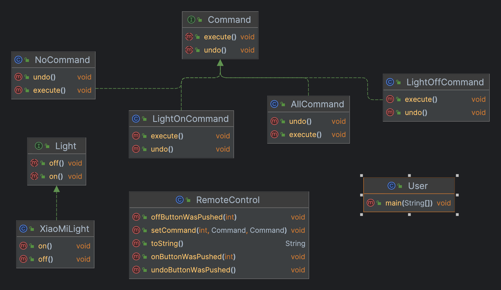

## 定义

在一个方法中定义一个方法骨架，而将一些步骤延迟到子类中，子类可以在不改变算法结构的情况下，重新定义其中一个或多个步骤

## 真实世界类比

**怎么泡一壶茶？怎么泡一杯咖啡？**
1. 把水煮沸
2. 用沸水浸泡茶叶/用沸水冲泡咖啡粉
3. 把茶倒进辈子/把咖啡倒进杯子
4. 加柠檬/加糖和奶

过程泛化后：
1. 把水煮沸
2. 冲泡
3. 把饮品倒进杯子
4. 加调料

> 模板方法就是一组步骤组成的方法，其中每个步骤都可以是抽象的。


## 场景
泡多种咖啡因饮料

## 类图



> User（顾客）：客户负责创建一个Command命令，并设置接收者  
> RemoteControl（服务员）：触发者（Invoker）持有一个对象命令，并在某个时间点调用命令对象对execute()方法，将请求付诸行动  
> Command（LightOnCommand ...）（订单请求命令）：命令对象，将动作和接收者包装在一起，调用命令对象对execute()方法，就可以让接收者进行相关动作  
> Light（XiaoMiLight）（厨师）：接收者，实行这个请求。

## 实现 

### CaffeineBeverageWithHook（咖啡因饮料with钩子）

```java
public abstract class CaffeineBeverageWithHook {

  void prepareRecipe() {
    boilWater();
    brew();
    pourInCup();
    if (condiments()) {
      addCondiments();
    }
  }

  protected abstract void addCondiments();

  boolean condiments() {
    return true;
  }

  private void pourInCup() {
    System.out.println("Pouring into cup.....");
  }

  protected abstract void brew();

  private void boilWater() {
    System.out.println("Boiling water.....");
  }
}
```

### CoffeeWithHook ...（coffee）
 
```java
public class CoffeeWithHook extends CaffeineBeverageWithHook {

  @Override
  protected void addCondiments() {
    System.out.println("Adding sugar and milk....");
  }

  @Override
  protected void brew() {
    System.out.println("Dripping coffee through filter.....");
  }
}
```

### TeaWithHook（Tea）

```java
public class TeaWithHook extends CaffeineBeverageWithHook {

  @Override
  protected void addCondiments() {
    System.out.println("Adding lemon....");
  }

  @Override
  protected void brew() {
    System.out.println("Add tea.....");
  }

  @Override
  boolean condiments() {
    return false;
  }
}
```

> `hook`钩子让子类对模版中某些步骤做出反应
{: .prompt-tip }

### BeverageTestDrive

```java
public class BeverageTestDrive {

  public static void main(String[] args) {
    TeaWithHook teaWithHook = new TeaWithHook();
    teaWithHook.prepareRecipe();

    CoffeeWithHook coffeeWithHook = new CoffeeWithHook();
    coffeeWithHook.prepareRecipe();
  }
}
```

## 适用场景

1. 如果你需要通过操作来参数化对象， 可使用命令模式
2. 如果你想要将操作放入队列中、操作的执行或者远程执行操作， 可使用命令模式
3. 如果你想要实现操作回滚功能，可使用命令模式

## 特点

- 优点
  + 单一职责原则：可以解耦触发和执行操作的类
  + 开闭原则：你可以在不修改已有客户端代码的情况下在程序中创建新的命令
  + 你可以实现撤销和恢复功能
  + 你可以实现操作的延迟执行
  + 你可以将一组简单命令组合成一个复杂命令
- 缺点
  + 代码可能会变得更加复杂， 因为你在发送者和接收者之间增加了一个全新的层次


> 代码下载地址：<https://github.com/ni-shiliu/neil-design-mode> 
{: .prompt-info }  

> 参考：《Head First 设计模式》


