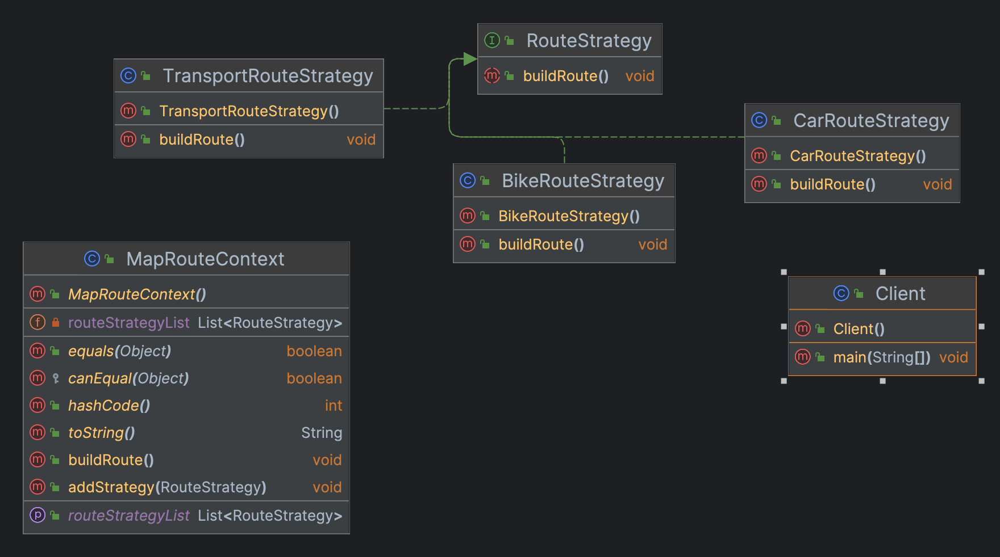

## 定义

定义一系列算法， 并将每种算法分别放入独立的类中， 以使算法的对象能够相互替换

## 真实世界类比

**百度地图计算路线**
百度地图app计算两地点之间的路线，可以选择骑行、自驾、公共交通等方式，不同的方式，计算的结果都不相同。


## 场景
设计一款地图app
1. 根据不同的出行方式，计算出不同的结果
2. 支持多种出行方式组合计算
3. 便于以后扩展

## 类图



## 实现 

### MapRouteContent（策略上下文）

```java
public class MapRouteContent {

  private List<RouteStrategy> routeStrategyList;

  public void addStrategy(RouteStrategy routeStrategy) {
    if (CollUtil.isEmpty(routeStrategyList)) {
      routeStrategyList = new ArrayList<>();
    }
    routeStrategyList.add(routeStrategy);
  }

  public void buildRoute() {
    if (CollUtil.isEmpty(routeStrategyList)) {
      return;
    }
    for (RouteStrategy routeStrategy : routeStrategyList) {
      routeStrategy.buildRoute();
    }
  }
}
```

### RouteStrategy（策略）
 
```java
public interface RouteStrategy {

  void buildRoute();
}
```

### BikeRouteStrategy & CarRouteStrategy & TransportRouteStrategy（具体策略）

```java
public class CarRouteStrategy implements RouteStrategy {

  @Override
  public void buildRoute() {
    System.out.println("Car is building route.......");
  }
}

public class BikeRouteStrategy implements RouteStrategy {

  @Override
  public void buildRoute() {
    System.out.println("Bike is building route.......");
  }
}

public class TransportRouteStrategy implements RouteStrategy {

  @Override
  public void buildRoute() {
    System.out.println("Transport is building route.......");
  }
}
```

### Client（客户端）

```java
public class Client {

  public static void main(String[] args) {
    MapRouteContent mapRouteContent = new MapRouteContent();

    BikeRouteStrategy bikeRouteStrategy = new BikeRouteStrategy();
    CarRouteStrategy carRouteStrategy = new CarRouteStrategy();
    TransportRouteStrategy transportRouteStrategy = new TransportRouteStrategy();

    mapRouteContent.addStrategy(bikeRouteStrategy);
    mapRouteContent.addStrategy(carRouteStrategy);
    mapRouteContent.addStrategy(transportRouteStrategy);

    mapRouteContent.buildRoute();
  }
}
```

## 适用场景

1. 当你想使用对象中各种不同的算法变体，并希望能在运行时切换算法时，可使用策略模式。
2. 当你有许多仅在执行某些行为时略有不同的相似类时，可使用策略模式

## 特点

- 优点
  + 你可以在运行时切换对象内的算法
  + 可以将算法的实现和使用算法的代码隔离开来
  + 可以使用组合来代替继承
  + 开闭原则。 你无需对上下文进行修改就能够引入新的策略
- 缺点
  + 如果你的算法极少发生改变，那么没有任何理由引入新的类和接口。使用该模式只会让程序过于复杂
  + 客户端必须知晓策略间的不同——它需要选择合适的策略

  

> 代码下载地址：<https://github.com/ni-shiliu/neil-design-mode> 
{: .prompt-info }  

> 参考：《Head First 设计模式》
