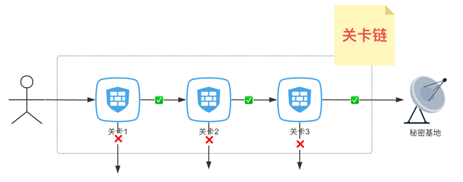
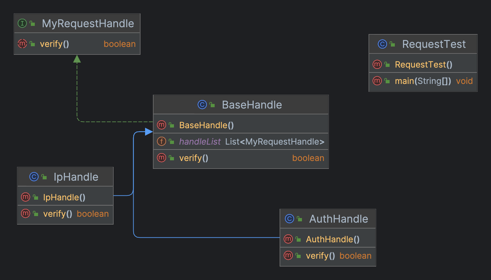

## 定义

将请求沿着处理者链进行发送，收到请求后，每个处理者均可对请求进行处理，或将其传递给链上的下个处理者

## 真实世界类比

**访问一个秘密基地**
当去访问一个秘密基地时，一路上你会遇到很多关卡，每一个关卡都会核验你的身份信息和权限，只要有一个关卡不让通行，你就将停止前行。




## 场景
当一个请求打过来的时候，希望你对该请求进行验证
1. 会有不同的验证规则
2. 当不符合某一个规则时，即失败
3. 便于以后扩展

## 类图



## 实现 

### MyRequestHandle

```java
public interface MyRequestHandle {

  boolean verify();
}
```

### BaseHandle

```java
public class BaseHandle implements MyRequestHandle {

  public static List<MyRequestHandle> handleList = Arrays.asList(
    new AuthHandle(),
    new IpHandle()
  );

  @Override
  public boolean verify() {
    for (MyRequestHandle myRequestHandle : handleList) {
      if (!myRequestHandle.verify()) {
        return false;
      }
    }
    return true;
  }
}

```

### AuthHandle & IpHandle

```java
public class AuthHandle extends BaseHandle {

    @Override
    public boolean verify() {
        System.out.println("AuthHandle verify start....");
        return false;
    }
}

public class IpHandle extends BaseHandle {

  @Override
  public boolean verify() {
    System.out.println("IpHandle verify start...");
    return true;
  }
}
```

### Client（客户端）

```java
public class RequestTest {

  public static void main(String[] args) {

    BaseHandle baseHandle = new BaseHandle();
    if (!baseHandle.verify()) {
      System.out.println("verify fail...");
      return;
    }
    System.out.println("verify success...");
 
  }
}
```

## 适用场景

1. 当必须按顺序执行多个处理者时，可以使用该模式。

## 特点

- 优点
  + 你可以控制请求处理的顺序
  + 单一职责原则。你可对发起操作和执行操作的类进行解耦
  + 开闭原则。 你无需对上下文进行修改就能够引入新的策略
- 缺点
  + 部分请求可能未被处理。
  

> 代码下载地址：<https://github.com/ni-shiliu/neil-design-mode> 
{: .prompt-info }  

> 参考：《Head First 设计模式》
