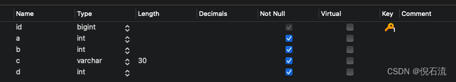
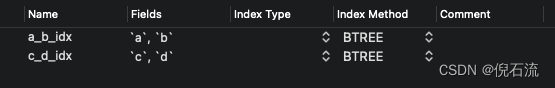
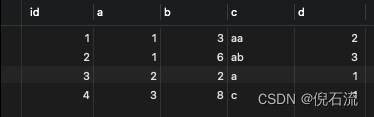
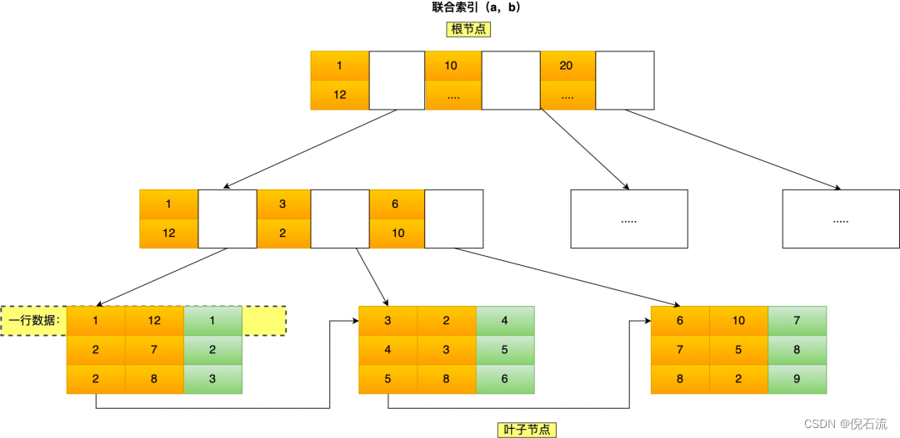

## 前言

如果问你mysql**最左匹配原则**是什么？我们大部分人都会脱口而出：在组合索引时，满足最左优先，从左往右匹配，遇到>、<、>=、<=、between、like就会停止匹配。然而真的是这样吗？

## 实验

### 准备
新建表：mysql_index_test  

字段：


联合索引：B+tree索引，字段a和b是联合索引，字段c和d是联合索引  


测试数据：  


### Query1

```mysql
select * from mysql_index_test where a > 5 and b = 0;
```
问：用到了索引的哪些字段？  
答：索引a_b_idx中的：a
执行计划：  
```mysql
EXPLAIN select * from mysql_index_test where a > 5 and b = 0;
```
  
key_len=4(字段a，int类型并且不为null)


### Query2

```mysql
select * from mysql_index_test where a >= 5 and b = 0;
```
问：用到了索引的哪些字段？  
答：索引a_b_idx中的：a和b
执行计划：
```mysql
EXPLAIN select * from mysql_index_test where a >= 5 and b = 0;
```
  
key_len=4(字段a，int类型并且不为null) + 4 (字段b，int类型并且不为null) = 8


### Query3

```mysql
select * from mysql_index_test where a BETWEEN 1 and 2 and b = 0;
```
问：用到了索引的哪些字段？  
答：索引a_b_idx中的：a
执行计划：
```mysql
EXPLAIN select * from mysql_index_test where a BETWEEN 1 and 2 and b = 0;
```
  
key_len=4(字段a，int类型并且不为null) + 4 (字段b，int类型并且不为null) = 8


### Query4

```mysql
select * from mysql_index_test where c like 'a%' and d = 1;
```
问：用到了索引的哪些字段？
答：索引c_d_idx中的：c和d
执行计划：
```mysql
EXPLAIN select * from mysql_index_test where c like 'a%' and d = 1;
```
  
key_len=120(字段c，varchar(30)并且不为null) + 2(字段c变长类型的字段需要+2) + 4 (字段d，int类型并且不为null) = 126

## 原因分析

mysql的组合索引结构如下图：


**联合索引的特点：a字段全局有序，b字段值在a相同的情况下局部有序**  

**sql1**：a>5 and b = 0：  
满足a > 5范围的b是无序的，无法定位到具体的开始位置，所以b字段无法用到b索引；  
**sql2和sql3**：a>=5 and b=0 和 a BETWEEN 1 and 2 and b = 0，mysql的between左右到包含，可以等同于>=和<=：  
满足a >= 5范围中a=5时的b是有序的，可以定位到具体的a=5,b=2的开始位置，所以可以用到b索引；  
**sql4**：like ‘a%’ and d = 1，匹配规则aXXX，类似于>=，所以也可以用到d索引
## 结论
mysql联合索引的最左匹配原则：在遇到范围查询（如 >、<）的时候，就会停止匹配，也就是范围查询的字段可以用到联合索引，但在范围查询字段后面的字段都无法用到联合索引。 >=、<=、BETWEEN、like 前缀匹配的范围查询，并不会停止匹配。


> 代码下载地址：<https://github.com/ni-shiliu/neil-design-mode> 
{: .prompt-info }  

> 参考：《Head First 设计模式》
