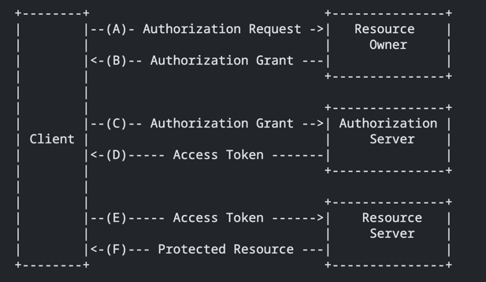
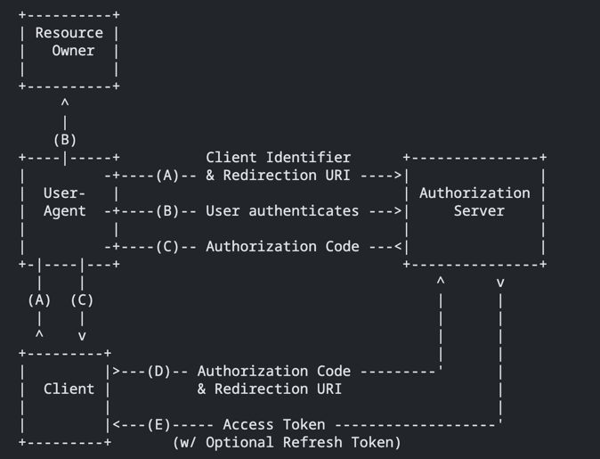
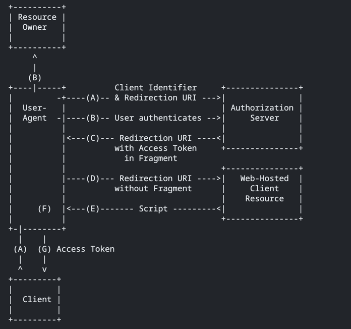
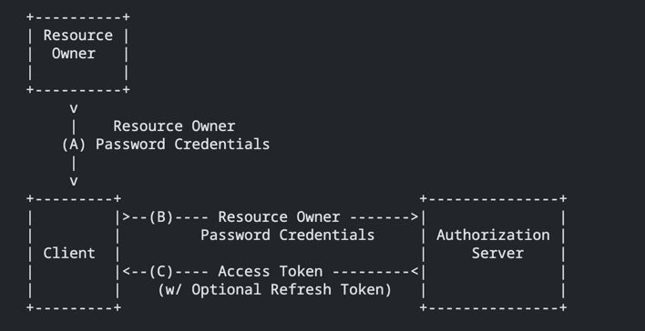
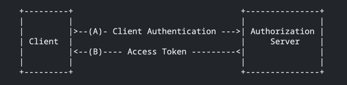

## 概念

```text
   The OAuth 2.0 authorization framework enables a third-party
   application to obtain limited access to an HTTP service, either on
   behalf of a resource owner by orchestrating an approval interaction
   between the resource owner and the HTTP service, or by allowing the
   third-party application to obtain access on its own behalf.  This
   specification replaces and obsoletes the OAuth 1.0 protocol described
   in RFC 5849.
```
OAuth2.0授权框架允许第三方应用程序通过协调资源所有者和HTTP服务之间的审批交互，或者通过允许第三方应用程序以自己的名义获得访问权限，获取对HTTP服务的有限访问权限。这规范取代并废弃了所描述的OAuth1.0协议在RFC5849。  

> OAuth2.0是一种授权协议，只表示一种约定的流程和规范。一般用于用户决定是否把自己在某个服务商上面的资源授权给第三方应用访问。

## 应用场景

1. 应用于第三方应用登录，将受保护的用户资源授权给第三方信任用户，从而避免二次登录造成泄密
2. 应用于多服务场景种，用于服务的统一登录认证，对内部之间对资源请求进行权限管理

## 四种角色

**resource owner**：资源的拥有者，通常就是用户，比如登录的用户
  
**resource server**：资源服务，提供资源的服务。需要access_token才允许被调用。比如微信api，通过access_token调用它可以获取到用户的性别等信息  

**client**：客户端，第三方客户端，被授权访问的应用。比如石墨文档通过微信登录的时候，石墨文档就是client角色，它要用户授权获取用户微信的信息  

**authorization server**：资源认证授权服务。用户登录到本服务后，可以选择授权给第三方。比如微信登录，微信认证服务就是authorization server的角色。可以颁发给client code，可以通过code换取access token. 可以通过access_token认证用户  

## 工作流程



（A）客户端向资源所有者请求授权  

（B）用户点确认，微信就会给client一个临时授权code  

（C）client拿着上一步得到的授权code去找authorization server换一个access_token  

（D）authorization server认证了client的参数，确认后，给client返回access_token  

（E）client拿access_token去获取信息，比如获取用户昵称，头像  

（F）资源服务器验证访问令牌，如果有效，服务于请求。

## 授权方式

### Authorization Code（授权码）

授权码是目前OAuth 2.0 中最常用的。通过去授权端获取授权码，利用授权码换取token，通过使用token去资源服务器获取受保护资源。



（A）客户端发起获取code操作，并给予资源认证服务重定向地址

（B）资源的拥有者授权

（C）资源认证授权服务返回code，并重定向URI

（D）客户端带上code获取access token

（E）返回access token  

#### Authorization Request（获取code）

request param:
 - response_type：必填，固定值code
 - client_id：必填，应用的身份标识Id
 - redirect_uri：必填，重定向地址
 - scope：可选，授权范围
 - state：推荐，防止csrf跨站请求伪造攻击

```shell
GET /authorize?response_type=code&client_id=s6BhdRkqt3&state=xyz&redirect_uri=https%3A%2F%2Fclient%2Eexample%2Ecom%2Fcb HTTP/1.1
```

response:
  - code：授权服务器生成的授权码(临时的)
  - state：为Client提供的字符串，授权服务器原样返回，用于Client防止CSRF攻击


#### Access Token Request（获取token）

request param:
  - grant_type：必填，固定值authorization_code
  - code：必填，返回的code
  - client_id：必填，应用的身份标识Id
  - refresh_token: 可选，刷新token时必填

```shell
curl -i -X POST -H 'content-type: application/json' -d '{"grant_type":"authorization_code","code":"xxxajoweuoiuio","client_id":"fasdfqwe","redirect_uri":"myurl.com"}' 'server.example.com' 
```

response:
```json
  {
       "access_token":"2YotnFZFEjr1zCsicMWpAA",
       "token_type":"example",
       "expires_in":3600,
       "refresh_token":"tGzv3JOkF0XG5Qx2TlKWIA",
       "example_parameter":"example_value"
     }
```

### Implicit（隐式授权）

在授权码的环节上做了一些简化，原有返回授权码的过程变成了直接返回访问令牌。这种情况在纯前端Web应用中(如SPA、浏览器插件)常出现，没有后台，在浏览器中需要负责完成所有过程。




#### Access Token Request（获取token）

request param:
- response_type：必填，固定值token
- client_id：必填，应用的身份标识Id
- redirect_uri：必填，授权成功后从授权服务器重定向回client的地址
- scope：必填，授权范围
- state: 推荐，防止csrf跨站请求伪造攻击

response:
```json
  {
       "access_token":"2YotnFZFEjr1zCsicMWpAA",
       "token_type":"example",
       "expires_in":3600,
       "refresh_token":"tGzv3JOkF0XG5Qx2TlKWIA",
       "example_parameter":"example_value"
     }
```


### Resource Owner Password Credentials（资源所有者密码凭证授权）

这种方式将资源所有者的身份标识信息(账号密码，提供给Client，然后Client再去授权服务器换取访问令牌)，这种安全风险大，更多是完全信任Client才会使用。



#### Access Token Request（获取token）

request param:
- response_type：必填，固定值password
- client_id：必填，应用的身份标识Id
- username: 可选，用户名
- password: 可选，密码
- scope: 可选，授权范围

- response:
```json
  {
       "access_token":"2YotnFZFEjr1zCsicMWpAA",
       "token_type":"example",
       "expires_in":3600,
       "refresh_token":"tGzv3JOkF0XG5Qx2TlKWIA",
       "example_parameter":"example_value"
     }
```


### Client Credentials（客户端凭证授权）

有些场景下，资源所有者不能直接参与，即没有与用户的交互这一过程，像后台任务，定时Job等是直接由Client Server去请求Authorization Server，这种即Machine to Machine。



request param:
- response_type：必填，固定值client_credentials
- scope: 可选，授权范围

- response:
```json
  {
       "access_token":"2YotnFZFEjr1zCsicMWpAA",
       "token_type":"example",
       "expires_in":3600,
       "refresh_token":"tGzv3JOkF0XG5Qx2TlKWIA",
       "example_parameter":"example_value"
     }
```

