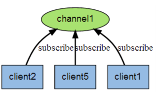
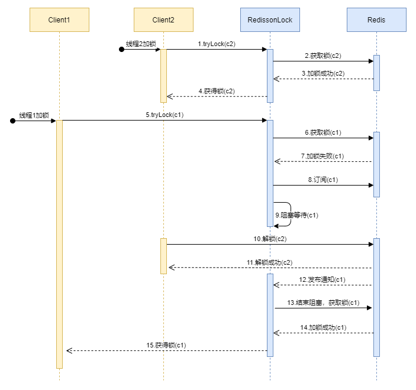

## 1 概述

Redisson是一个在Redis的基础上实现的Java驻内存数据网格（In-Memory Data Grid）。它不仅提供了一系列的分布式的Java常用对象，还提供了许多分布式服务。
其中包括(BitSet, Set, Multimap, SortedSet, Map, List, Queue, BlockingQueue, Deque, BlockingDeque, Semaphore, Lock, AtomicLong, 
CountDownLatch, Publish / Subscribe, Bloom filter, Remote service, Spring cache, Executor service, Live Object service, Scheduler service) 
Redisson提供了使用Redis的最简单和最便捷的方法。Redisson的宗旨是促进使用者对Redis的关注分离（Separation of Concern），从而让使用者能够将精力更集中地放在处理业务逻辑上。

## 2 使用

### 2.1 maven

```xml
<dependency>
  <groupId>org.redisson</groupId>
  <artifactId>redisson-spring-boot-starter</artifactId>
  <version>3.36.0</version>
</dependency>
```

### 2.2 配置

```java
@Configuration
@RequiredArgsConstructor
@ConditionalOnProperty(prefix = "redisson", value = "enabled", havingValue = "true")
public class RedissonConfig {

    @Value("${redisson.address}")
    private String address;

    @Bean
    public RedissonClient redissonClient() {
        Config config = new Config();
        // 集群
//        config.useClusterServers();
        // 哨兵
//        config.useSentinelServers();
        // 单节点
        config.useSingleServer()
                .setAddress(address);

        return Redisson.create(config);
    }
}
```
应用配置：

```yaml
redisson:
  enabled: true
  address: redis://localhost:6379
```

### 2.3 分布式锁

#### 2.3.1 lock

> **lock()**: 尝试获取锁，一直等待，直到获取到锁  
> **lock.lock(10, TimeUnit.SECONDS)**: 尝试获取锁，一直等待，直到获取到锁，leaseTime后锁自动失效

```java
    private final RedissonClient redissonClient;

    private static final String LOCK_PREFIX = "REDISSON_KEY_";

    @Operation(summary = "lock")
    @GetMapping("lock")
    public BaseResult<Void> lock(@RequestParam("orderNo") String orderNo) {
        RLock lock = redissonClient.getLock(LOCK_PREFIX + orderNo);
        // 尝试获取锁，一直等待，直到获取到锁
        lock.lock();
        // 尝试获取锁，一直等待，直到获取到锁，leaseTime后锁自动失效
//        lock.lock(10, TimeUnit.SECONDS);
        try {
            // 执行业务
            System.out.println("lock acquired for orderNo: " + orderNo);
        } catch (Exception e) {
            return BaseResult.fail("执行业务失败。");
        } finally {
            if (lock.isLocked() && lock.isHeldByCurrentThread()) {
                lock.unlock();
            }
        }
        return BaseResult.success();
    }
```

#### 2.3.2 tryLock

> **lock.tryLock()**: 尝试获取锁，不等待，未获取到锁则返回false  
> **lock.tryLock(5, TimeUnit.SECONDS)**: 尝试获取锁，最多等待5S，未获取到锁则返回false  
> **lock.tryLock(5, 10, TimeUnit.SECONDS)**: 尝试获取锁，最多等待5秒，最长等待10秒，未获取到锁则返回false

```java
    @Operation(summary = "tryLock")
    @GetMapping("tryLock")
    public BaseResult<Void> tryLock(@RequestParam("orderNo") String orderNo) {
        RLock lock = redissonClient.getLock(LOCK_PREFIX + orderNo);
        try {
            // 尝试获取锁，不等待， 未获取到锁则返回false
//            if (lock.tryLock()) {
            // 尝试获取锁，最多等待5S
//            if (lock.tryLock(5, TimeUnit.SECONDS)) {
            // 尝试获取锁，最多等待 5 秒，最长等待 10 秒
            if (lock.tryLock(5, 10, TimeUnit.SECONDS)) {
                // 执行业务
                System.out.println("lock acquired for orderNo: " + orderNo);
            } else {
                return BaseResult.fail("锁已被占用，请稍后重试");
            }
        } catch (Exception e) {
            return BaseResult.fail("执行业务失败。");
        } finally {
            if (lock.isLocked() && lock.isHeldByCurrentThread()) {
                lock.unlock();
            }
        }
        return BaseResult.success();
    }
```

## 3 Redis订阅/发布机制

Redis 发布订阅 (pub/sub) 是一种消息通信模式：发送者 (pub) 发送消息，订阅者 (sub) 接收消息。
Redis 客户端可以订阅任意数量的频道。
下图展示了频道 channel1，以及订阅这个频道的三个客户端 —— client2、client5和client1之间的关系：



### 3.1 client1订阅名为`hello`的channel

```shell
127.0.0.1:6379> subscribe hello
```
### 3.2 client2向`hello`的channel发送消息

```shell
127.0.0.1:6379> publish hello "hello word!"
```

### 3.3 client1收到结果
```shell
127.0.0.1:6379> subscribe hello
1) "subscribe"
2) "hello"
3) (integer) 1
1) "message"
2) "hello"
3) "hello word!"
```

## 4 源码解读

> version: 3.36.0

### 4.1 加锁



#### 4.1.1 tryLock

```java
public boolean tryLock(long waitTime, long leaseTime, TimeUnit unit) throws InterruptedException {
        // 等待时间
        long time = unit.toMillis(waitTime);
        // 当前时间
        long current = System.currentTimeMillis();
        // 当前线程ID
        long threadId = Thread.currentThread().getId();
        // 尝试获取锁，加锁成功返回null，失败返回锁的ttl时间
        Long ttl = tryAcquire(waitTime, leaseTime, unit, threadId);
        if (ttl == null) {
            // 加锁成功
            return true;
        }
        
        time -= System.currentTimeMillis() - current;
        if (time <= 0) {
            // time <= 0 表示超过waitTime时间
            // 该方法返回一个CompletableFuture(null)，钩子方法
            acquireFailed(waitTime, unit, threadId);
            return false;
        }
        
        current = System.currentTimeMillis();
        // 订阅
        CompletableFuture<RedissonLockEntry> subscribeFuture = subscribe(threadId);
        try {
            subscribeFuture.get(time, TimeUnit.MILLISECONDS);
        } catch (TimeoutException e) {
            if (!subscribeFuture.completeExceptionally(new RedisTimeoutException(
                    "Unable to acquire subscription lock after " + time + "ms. " +
                            "Try to increase 'subscriptionsPerConnection' and/or 'subscriptionConnectionPoolSize' parameters."))) {
                subscribeFuture.whenComplete((res, ex) -> {
                    if (ex == null) {
                        unsubscribe(res, threadId);
                    }
                });
            }
            acquireFailed(waitTime, unit, threadId);
            return false;
        } catch (ExecutionException e) {
            LOGGER.error(e.getMessage(), e);
            acquireFailed(waitTime, unit, threadId);
            return false;
        }

        try {
            // 判断是否超时（超过了waitTime）
            time -= System.currentTimeMillis() - current;
            if (time <= 0) {
                acquireFailed(waitTime, unit, threadId);
                return false;
            }
            
            // 死循环
            while (true) {
                long currentTime = System.currentTimeMillis();
                // 再次获取锁，成功则返回
                ttl = tryAcquire(waitTime, leaseTime, unit, threadId);
                // lock acquired
                if (ttl == null) {
                    return true;
                }

                time -= System.currentTimeMillis() - currentTime;
                if (time <= 0) {
                    acquireFailed(waitTime, unit, threadId);
                    return false;
                }

                // waiting for message
                // 阻塞等待信号量唤醒或者超时，接收到订阅时唤醒
                // 使用的是Semaphore#tryAcquire()
                currentTime = System.currentTimeMillis();
                if (ttl >= 0 && ttl < time) {
                    commandExecutor.getNow(subscribeFuture).getLatch().tryAcquire(ttl, TimeUnit.MILLISECONDS);
                } else {
                    commandExecutor.getNow(subscribeFuture).getLatch().tryAcquire(time, TimeUnit.MILLISECONDS);
                }

                time -= System.currentTimeMillis() - currentTime;
                if (time <= 0) {
                    acquireFailed(waitTime, unit, threadId);
                    return false;
                }
            }
        } finally {
            // 取消订阅
            unsubscribe(commandExecutor.getNow(subscribeFuture), threadId);
        }
//        return get(tryLockAsync(waitTime, leaseTime, unit));
    }
```
> tryLock加锁逻辑：
> 1. 尝试加锁，成功则返回ture, 失败则往下走
> 2. 判断是否超时，超时则返回false
> 3. 订阅channel
> 4. 判断是否超时，超时则返回false
> 5. 循环（尝试获取锁 -> 判断是否超时 -> 阻塞等待）
> 6. 取消订阅
{: .prompt-info }

#### 4.1.2 `tryAcquire`核心加锁逻辑

```java
private Long tryAcquire(long waitTime, long leaseTime, TimeUnit unit, long threadId) {
  return get(tryAcquireAsync0(waitTime, leaseTime, unit, threadId));
}

private RFuture<Long> tryAcquireAsync0(long waitTime, long leaseTime, TimeUnit unit, long threadId) {
  return getServiceManager().execute(() -> tryAcquireAsync(waitTime, leaseTime, unit, threadId));
}

private RFuture<Long> tryAcquireAsync(long waitTime, long leaseTime, TimeUnit unit, long threadId) {
        RFuture<Long> ttlRemainingFuture;
        if (leaseTime > 0) {
            // 设置了过期时间leaseTime
            ttlRemainingFuture = tryLockInnerAsync(waitTime, leaseTime, unit, threadId, RedisCommands.EVAL_LONG);
        } else {
            // 未设置过期时间，则过期时间使用默认internalLockLeaseTime=30s
            ttlRemainingFuture = tryLockInnerAsync(waitTime, internalLockLeaseTime,
                    TimeUnit.MILLISECONDS, threadId, RedisCommands.EVAL_LONG);
        }
        CompletionStage<Long> s = handleNoSync(threadId, ttlRemainingFuture);
        ttlRemainingFuture = new CompletableFutureWrapper<>(s);

        CompletionStage<Long> f = ttlRemainingFuture.thenApply(ttlRemaining -> {
            // lock acquired
            // ttlRemaining == null,说明加锁成功，准备开启watchDog
            if (ttlRemaining == null) {
                if (leaseTime > 0) {
                    internalLockLeaseTime = unit.toMillis(leaseTime);
                } else {
                    // 未设置过期时间，则开启watchDog
                    scheduleExpirationRenewal(threadId);
                }
            }
            return ttlRemaining;
        });
        return new CompletableFutureWrapper<>(f);
    }

```

### 4.1.3 LUA脚本

```java
    <T> RFuture<T> tryLockInnerAsync(long waitTime, long leaseTime, TimeUnit unit, long threadId, RedisStrictCommand<T> command) {
        return evalWriteSyncedAsync(getRawName(), LongCodec.INSTANCE, command,
                // 如果key不存在，（不存在返回0）
                "if ((redis.call('exists', KEYS[1]) == 0) " +
                            // 或者key存在，value=当前线程
                            "or (redis.call('hexists', KEYS[1], ARGV[2]) == 1)) then " +
                        // 设置key,将key计数+1
                        "redis.call('hincrby', KEYS[1], ARGV[2], 1); " +
                        // 设置ttl
                        "redis.call('pexpire', KEYS[1], ARGV[1]); " +
                        // 返回nil， 表示加锁成功
                        "return nil; " +
                    "end; " +
                    // 否则返回key的ttl
                    "return redis.call('pttl', KEYS[1]);",
                Collections.singletonList(getRawName()), unit.toMillis(leaseTime), getLockName(threadId));
    }
```

### 4.1.4 订阅-阻塞-唤醒

#### 订阅 - PublishSubscribe.java

```java
    private RedisPubSubListener<Object> createListener(String channelName, E value) {
        RedisPubSubListener<Object> listener = new BaseRedisPubSubListener() {

            @Override
            public void onMessage(CharSequence channel, Object message) {
                if (!channelName.equals(channel.toString())) {
                    return;
                }

                PublishSubscribe.this.onMessage(value, (Long) message);
            }
        };
        return listener;
    }
```

#### 阻塞等待 - AQS

```java
    public boolean tryAcquire(long timeout, TimeUnit unit)
        throws InterruptedException {
        return sync.tryAcquireSharedNanos(1, unit.toNanos(timeout));
    }

    public final boolean tryAcquireSharedNanos(int arg, long nanosTimeout)
        throws InterruptedException {
        if (!Thread.interrupted()) {
            if (tryAcquireShared(arg) >= 0)
                return true;
            if (nanosTimeout <= 0L)
                return false;
            int stat = acquire(null, arg, true, true, true,
                System.nanoTime() + nanosTimeout);
            if (stat > 0)
                return true;
            if (stat == 0)
                return false;
        }
      throw new InterruptedException();
}

```

#### 被唤醒 - SemaphorePubSub.java
```java
    protected void onMessage(RedissonLockEntry value, Long message) {
        value.tryRunListener();
        value.getLatch().release(Math.min(value.acquired(), message.intValue()));
    }
```

#### 4.1.5 watchDog（看门狗）
试想一个场景：程序执行需要10秒，程序执行完成才去解锁，而锁的存活时间只有5秒，也就是程序执行到一半的时候锁就可以被其他程序获取了，
这显然不合适。那么怎么解决呢？

1. 方式1: 锁不设置过期时间，
   弊端：如果还没解锁，服务就挂了，则会造成死锁
2. 方式2：设置过期时间，但是有监控程序，若程序还没执行完成，则给锁续期

```java
    protected void scheduleExpirationRenewal(long threadId) {
        ExpirationEntry entry = new ExpirationEntry();
        entry.addThreadId(threadId);
        ExpirationEntry oldEntry = EXPIRATION_RENEWAL_MAP.putIfAbsent(getEntryName(), entry);
        if (oldEntry != null) {
            oldEntry.addThreadId(threadId);
        } else {
            try {
                // 看门狗的具体逻辑
                renewExpiration();
            } finally {
                if (Thread.currentThread().isInterrupted()) {
                    cancelExpirationRenewal(threadId, null);
                }
            }
        }
    }
```

```java
private void renewExpiration() {
        ExpirationEntry ee = EXPIRATION_RENEWAL_MAP.get(getEntryName());
        if (ee == null) {
            return;
        }
        // 创建延时任务，延时时间是internalLockLeaseTime / 3
        Timeout task = getServiceManager().newTimeout(new TimerTask() {
            @Override
            public void run(Timeout timeout) throws Exception {
                ExpirationEntry ent = EXPIRATION_RENEWAL_MAP.get(getEntryName());
                if (ent == null) {
                    return;
                }
                Long threadId = ent.getFirstThreadId();
                if (threadId == null) {
                    return;
                }
                
                CompletionStage<Boolean> future = renewExpirationAsync(threadId);
                future.whenComplete((res, e) -> {
                    if (e != null) {
                        if (getServiceManager().isShuttingDown(e)) {
                            return;
                        }

                        log.error("Can't update lock {} expiration", getRawName(), e);
                        EXPIRATION_RENEWAL_MAP.remove(getEntryName());
                        return;
                    }
                    
                    if (res) {
                        // reschedule itself
                        // 锁续期成功，则再启动一个延时任务，继续监测
                        renewExpiration();
                    } else {
                        // 取消看门狗
                        cancelExpirationRenewal(null, null);
                    }
                });
            }
        }, internalLockLeaseTime / 3, TimeUnit.MILLISECONDS);
        
        ee.setTimeout(task);
    }
```

> Timeout 是一个延时任务，延时 internalLockLeaseTime / 3 时间执行。任务的内容主要是通过 renewExpirationAsync 方法对锁进行续期，
> 如果续期失败（解锁了、锁到期等），则取消看门狗，如果续期成功，则递归 renewExpiration 方法，继续创建延时任务。

### 4.2 解锁

```java
private RFuture<Void> unlockAsync0(long threadId) {
        // 调用lua解锁
        CompletionStage<Boolean> future = unlockInnerAsync(threadId);
        CompletionStage<Void> f = future.handle((res, e) -> {
            // 取消看门狗
            cancelExpirationRenewal(threadId, res);

            if (e != null) {
                if (e instanceof CompletionException) {
                    throw (CompletionException) e;
                }
                throw new CompletionException(e);
            }
            if (res == null) {
                IllegalMonitorStateException cause = new IllegalMonitorStateException("attempt to unlock lock, not locked by current thread by node id: "
                        + id + " thread-id: " + threadId);
                throw new CompletionException(cause);
            }

            return null;
        });

        return new CompletableFutureWrapper<>(f);
    }

```

```java
    protected RFuture<Boolean> unlockInnerAsync(long threadId, String requestId, int timeout) {
        return evalWriteSyncedAsync(getRawName(), LongCodec.INSTANCE, RedisCommands.EVAL_BOOLEAN,
                              "local val = redis.call('get', KEYS[3]); " +
                                    "if val ~= false then " +
                                        "return tonumber(val);" +
                                    "end; " +

                                    "if (redis.call('hexists', KEYS[1], ARGV[3]) == 0) then " +
                                        "return nil;" +
                                    "end; " +
                                    "local counter = redis.call('hincrby', KEYS[1], ARGV[3], -1); " +
                                    "if (counter > 0) then " +
                                        "redis.call('pexpire', KEYS[1], ARGV[2]); " +
                                        "redis.call('set', KEYS[3], 0, 'px', ARGV[5]); " +
                                        "return 0; " +
                                    "else " +
                                        "redis.call('del', KEYS[1]); " +
                                        "redis.call(ARGV[4], KEYS[2], ARGV[1]); " +
                                        "redis.call('set', KEYS[3], 1, 'px', ARGV[5]); " +
                                        "return 1; " +
                                    "end; ",
                                Arrays.asList(getRawName(), getChannelName(), getUnlockLatchName(requestId)),
                                LockPubSub.UNLOCK_MESSAGE, internalLockLeaseTime,
                                getLockName(threadId), getSubscribeService().getPublishCommand(), timeout);
    }
```

## 5 总结

本文介绍了redisson的使用以及`tryLock`加锁的机制，因为篇幅有限，很多细节聊的不够深刻，后续有时间会进行补充。


>  代码下载地址：  
> <https://github.com/ni-shiliu/neil-project-framework>  
> <https://github.com/redisson/redisson>  
{: .prompt-tip }  

> 参考：  
> <https://github.com/redisson/redisson>  
> <https://www.runoob.com/redis/redis-pub-sub.html>


